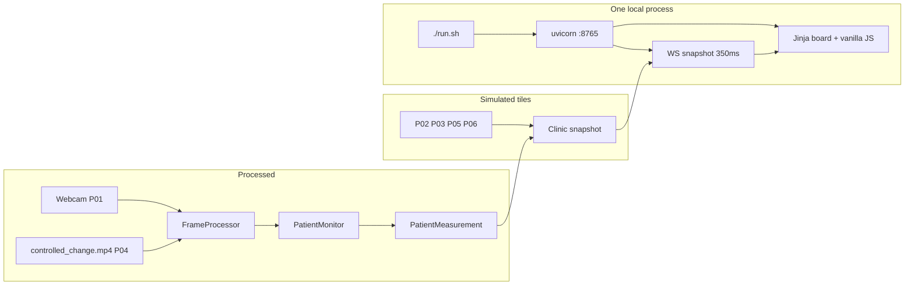
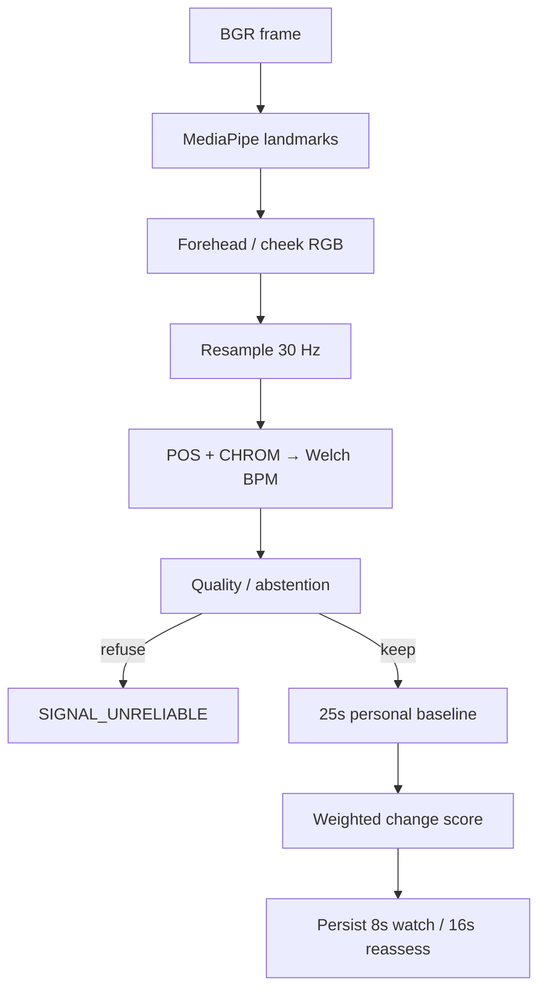

# TriageTracker

Public repo: https://github.com/RishabKattimani/TriageTracker

Contactless reassessment support for patients waiting after triage. An ordinary camera estimates pulse, builds a **patient-specific baseline**, refuses unreliable signal, and can recommend reassessment after a **sustained** change.

This is decision support. It does not diagnose, assign a clinical triage level, or replace a clinician.

Triage is a snapshot. Patients keep changing.

## Quick start

On a Mac with Python 3.11+:

```bash
./run.sh
```

That is the only required launch command. It will:

1. create or reuse `.venv`
2. install pinned dependencies
3. download MediaPipe models if they are missing
4. generate synthetic optical fixtures if they are missing
5. start the local server on `127.0.0.1:8765` (or `8766` / `8767` if busy)
6. wait until `/health` is ready
7. open the browser to the homepage

Optional:

```bash
./run.sh --no-browser
./run.sh --check
./run.sh --probe-camera
```

Then click **RUN GUIDED DEMO** (no camera) or **TRY LIVE CAMERA**.

## Tech stack

| Layer | Technology | Notes |
| --- | --- | --- |
| Launch | `./run.sh` + uvicorn | Local only. `127.0.0.1` |
| HTTP / WS | FastAPI, Jinja2, Starlette WebSocket | Pages, `/api/*`, `/ws/telemetry`, `/stream/{id}` |
| UI | Vanilla HTML / CSS / JS | Renders `PatientMeasurement`. Never assigns `REASSESS` |
| Video | OpenCV `VideoCapture` | Webcam (P01) and MP4 (P04) share `FramePacket` |
| Face / ROI | MediaPipe Face Landmarker | Forehead + both cheeks |
| Signals | NumPy, SciPy | POS/CHROM rPPG, Butterworth, Welch HR |
| State | In-process `Clinic` threads | Baseline, weighted rule score, persistence machine |
| Data | Synthetic optical fixtures | Generated locally. No cloud dataset |

No Docker. No Node. No npm. No hosted database. No API keys.

## Architecture



Pipeline inside `PatientMonitor`:



Only **P01** (live camera) and **P04** (recorded fixture) are processed. The other four cards are waiting-room context and never produce `REASSESS`.

## How to reproduce the demo

There are **no API keys**, no cloud accounts, and **no required `.env`**. If a `.env` file is present it is ignored by the app. A sample file would look like this:

```bash
# TriageTracker sample .env
# Copy is unnecessary. The app does not load environment secrets.
# Optional launcher overrides only:

# TRIAGETRACKER_SKIP_BROWSER=1
# TRIAGETRACKER_PORT=8765
```

Judge path:

1. `git clone https://github.com/RishabKattimani/TriageTracker.git`
2. `cd TriageTracker`
3. `git checkout rishab-product`
4. `./run.sh`
5. On the homepage, click **RUN GUIDED DEMO**
6. Watch **P04 · Recorded scenario**. It should baseline, then show a physiological change if Core emits one
7. Open the P04 card for baseline vs current, Why flagged, and RAW / EVM
8. Optional: **TRY LIVE CAMERA** for a real webcam path. If the camera is denied, Guided Demo still works
9. Optional: **Test UI** cycles official `/api/product-fixtures` onto P04 so you can see STABLE / UNRELIABLE / CHANGE_DETECTED / REASSESS. That path is labeled **not live Core state**. Do not present it as a live detection

Health: `http://127.0.0.1:8765/health`

## Datasets and synthetic data

No public clinical dataset is used. No wearable ground truth is used.

| Asset | Provenance | Role |
| --- | --- | --- |
| `fixtures/demo_plate.jpg` | Generated still (`app/synth.py`) | Photorealistic seated-patient plate. Not a clinical photo |
| `fixtures/controlled_change.mp4` | Same plate + injected optical pulse: 28s at 72 BPM, then 42s at 110 BPM | Guided Demo / P04 input |
| `fixtures/stable_seated.mp4` | Same plate + stable 72 BPM pulse | Repeatability / Core tests |
| `fixtures/no_face.mp4` | Dark frames | Must abstain, never alert |
| `models/face_landmarker.task` | Google MediaPipe Face Landmarker, downloaded by `./run.sh` if missing | Face / ROI |
| `models/pose_landmarker_lite.task` | MediaPipe Pose, downloaded if missing | Present; torso RR is not wired |

Regenerate fixtures:

```bash
source .venv/bin/activate
python scripts/generate_fixtures.py
```

Sidecar JSON may set `kind: synthetic_pulse`. Heart rate is still estimated from pixels, never hardcoded in the UI.

## Known limitations and next steps

**Limitations**

- Not clinically validated. Thresholds in `app/config.py` are prototype engineering values
- Core may finish the guided fixture in `STABLE` even when HR has moved (last observed: score ~0.60, persist ~7s; `CHANGE_DETECTED` needs 8s, `REASSESS` needs score 0.70 and 16s)
- Respiratory-rate attempt usually returns unavailable
- EVM is visualization-only and can crash with a numpy shape mismatch
- Four board tiles are simulated context
- Single-machine, single-process. Not a multi-tenant SaaS
- MediaPipe `num_faces=1`. Waiting-room-wide video is not a valid rPPG input
- No authentication, no audit log, no PHI store — by design for a local hackathon demo

**Next steps**

- Make a long high-confidence deviation reliably reach backend `REASSESS` without false alerts on spikes or no-face
- Keep abstention honest: motion, illumination, and low confidence must still never alert
- Fix EVM overlay crash or drop the toggle until it is stable
- Strengthen RR or keep saying it is unavailable
- If this ever left a laptop: add auth, tenant isolation, structured logs, and a clinical validation plan before anyone calls it a product

## Supported setup

- macOS
- Python 3.11 or newer
- Chrome or Safari
- optional MacBook webcam

## If something fails

| Symptom | What to do |
| --- | --- |
| `Python 3.11+ is required` | `brew install python@3.11`, then rerun `./run.sh` |
| Camera denied / missing | Guided Demo still works. macOS: System Settings → Privacy & Security → Camera |
| Missing fixture or model | `/health` names the exact path. Models download automatically. Fixtures belong in `fixtures/` |
| Port in use | The launcher tries `8765`, `8766`, then `8767` |
| Page says backend disconnected | The server stopped. Rerun `./run.sh` |

## Tests

```bash
source .venv/bin/activate
python -m pytest
```

## Two-person split

- **Product:** dashboard, Guided Demo, live camera, `./run.sh`. See this README
- **Core:** face / ROIs, rPPG, HR, quality, baseline, change engine. See `HANDOFF_RANVEER.md`
